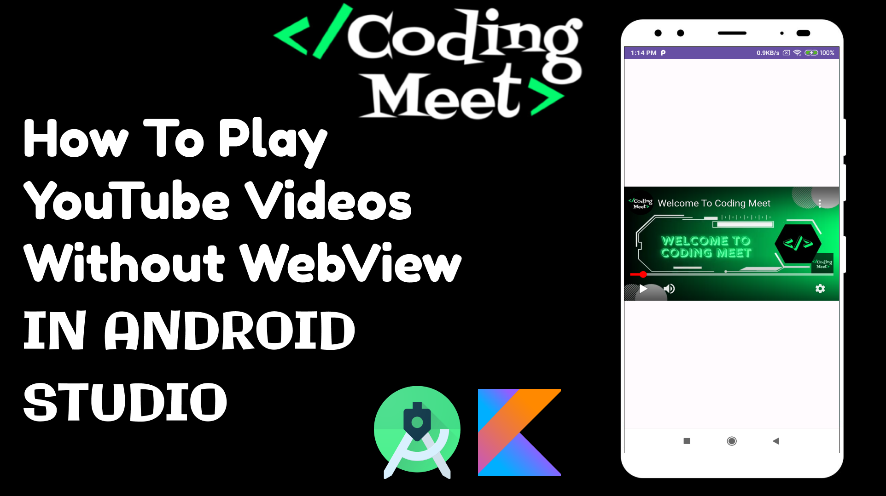
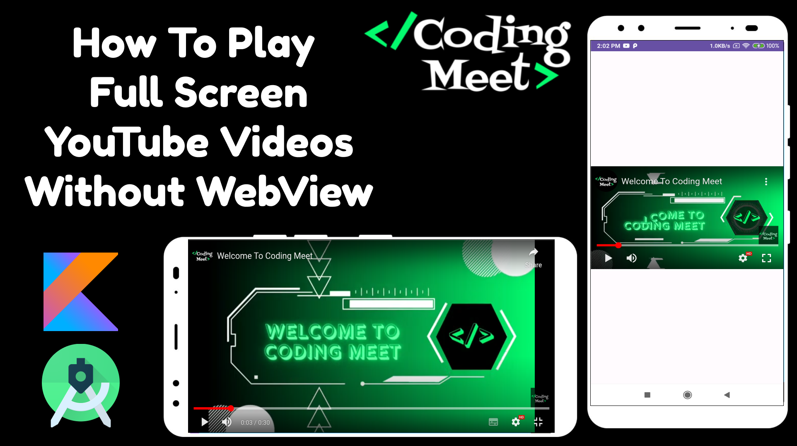

# Youtube Video Player in Android Studio Kotlin

Welcome to the Android Studio Kotlin YouTube Video Integration Tutorials playlist! 🚀 In this series, you'll learn how to seamlessly integrate and play YouTube videos directly in your Android app without relying on WebView. Whether you're an experienced app developer or a newcomer to Android development, these step-by-step tutorials will empower you to provide a superior video-watching experience in your app.

# [YouTube Video Link](https://www.youtube.com/playlist?list=PLlSuJy9SfzvHTrFGX3e09dgt1jgjCuOuv)

## Videos

1. **How to Play YouTube Videos Without WebView in Android Studio Kotlin**
   - Tired of the limitations of WebView? Learn to embed and play YouTube videos directly in your Android app using Kotlin.
   - Enhance user experience with seamless video playback and customized controls.

   

2. **How to Play Full-Screen YouTube Videos without WebView in Android Studio Kotlin**
   - Explore a comprehensive guide on playing full-screen YouTube videos without WebView in Android Studio using Kotlin.
   - Customize video controls and interactions for a polished full-screen video-watching experience.

   

## Support the Project

If you find this tutorial series helpful and would like to support the development of more content, consider buying me a coffee! Your support helps in creating high-quality tutorials.

Your generosity is greatly appreciated! Thank you for supporting this project.

